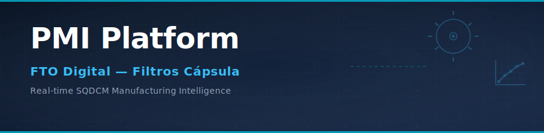
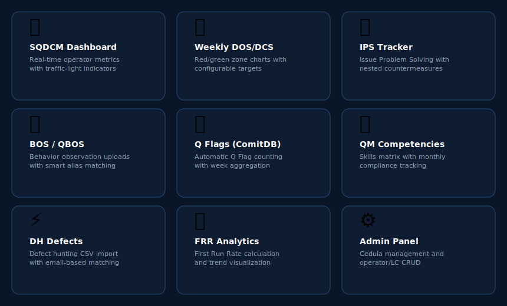
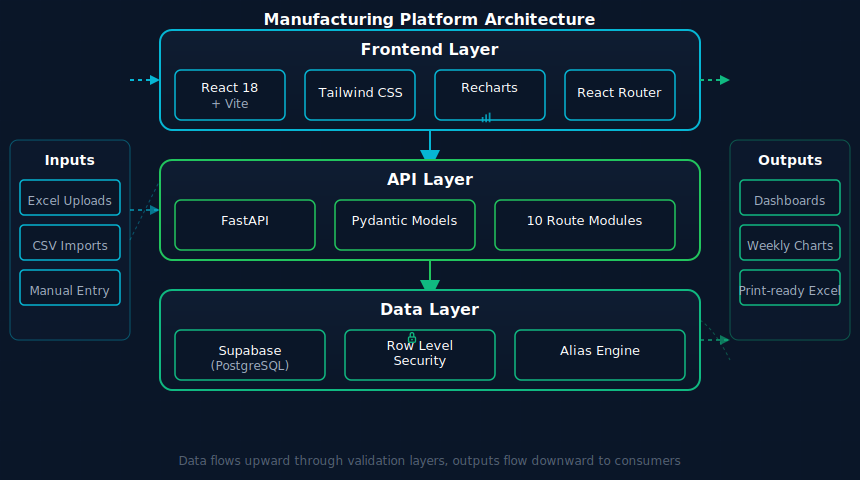

<p align="center">
  
</p>

<p align="center">
  
  
  
  
  
  
</p>

<p align="center">
  <strong>Full-stack manufacturing intelligence platform for real-time SQDCM tracking, weekly performance analytics, and operator development across Philip Morris International production lines.</strong>
</p>

---

## Overview

**PMI Platform — FTO Digital** is an internal enterprise tool built for the Filtros Cápsula and Filtros Blancos production lines at PMI Guadalajara. It replaces manual Excel-based workflows with a real-time digital platform that tracks Safety, Quality, Delivery, Cost, and Morale (SQDCM) indicators at the operator level on a weekly basis.

The platform ingests data from multiple factory systems (BOS, QBOS, ComitDB, DH exports, QM schedules) through smart file uploads with automatic employee matching, and surfaces it through interactive dashboards, weekly red/green zone charts, and print-ready Excel exports. Line Coordinators and Line Leads use it to make data-driven decisions on operator performance, competency gaps, and issue resolution.

---

## Features

<p align="center">
  
</p>

### Core Modules

**SQDCM Dashboard** — The central hub. Displays weekly operator metrics in a traffic-light grid organized by category (Sustainability, Quality, Delivery, Cost, Morale). Each cell is color-coded against its target. Supports filtering by Line Coordinator, automatic indicator population from upstream modules, and manual override with dirty-state tracking. Values that haven't been set default to "NA" for clear visibility.

**Weekly DOS/DCS** — Category-based weekly chart system where each indicator gets its own red/green zone chart. Supports three direction modes (higher-better, lower-better, middle-better with configurable band width), custom Y-axis ranges persisted to the database, and a per-machine view with priority-ordered indicators. Values can be entered as numeric or "NA" (Not Applicable), which renders as a small dot at the chart baseline.

**IPS — Issue Problem Solving** — Full lifecycle tracker for manufacturing issues. Each IPS record has KDF assignment, date, location, participants, and section completion checkboxes (6W2H, BBC, 5W, Resolution). Countermeasures nest under each IPS with owner, priority, status, and due date. Includes bulk Excel import with duplicate detection, inline record creation, and a redesigned print-ready Excel export with formatted nested tables.

**BOS / QBOS** — Uploads BOS (Behavior Observation System) CSV files and QBOS Excel files. Uses a 3-tier matching strategy: exact alias lookup, email-based matching, and fuzzy name matching with configurable confidence thresholds. Matched results are previewed before saving, with unmatched entries surfaced for manual resolution.

**Q Flags (ComitDB)** — Parses Excel exports from the ComitDB system. Extracts the `Created` date (mapped to ISO week), `[username]` (stripped of domain prefix, matched via alias or heuristic), and `Workcenter`. Aggregates Q Flag counts per operator per week and upserts into the dashboard's `qflags_num` column.

**QM — Competency Matrix** — Two-phase upload: (1) a yearly competency schedule/calendar per employee, and (2) weekly actual data. Analyzes employees against their forecasted targets with three views: per-employee detail, per-competency breakdown with expandable sub-tables showing below-target operators, and a monthly compliance tab with filterable KPI cards (Met 100%, Partial 70-99%, Below 70%).

**DH — Defect Hunting** — Imports defect hunting CSV files. Matches operators by email through the alias system. Calculates per-operator defect counts and repair rates, then syncs to the dashboard.

**FRR — First Run Rate** — Processes FRR data and calculates performance metrics per operator, feeding the dashboard's FRR indicators.

**Admin Panel** — CRUD management for cedulas (production line identities), Line Coordinators, operators (with machine and shift assignment), and line structure personnel (Line Lead, Maintenance, Process Lead). Supports the alias mapping Excel upload for configuring cross-system employee name/email variations.

---

## Architecture

<p align="center">
  
</p>

### Tech Stack

| Layer | Technology | Purpose |
|-------|-----------|---------|
| **Frontend** | React 18 + Vite 6 | SPA with hot module replacement |
| **Styling** | Tailwind CSS 4 | Utility-first dark theme (`#0a1628` / `#0f1d32`) |
| **Charts** | Recharts 3 | Composed charts with red/green zone rendering |
| **Routing** | React Router 6 | Client-side navigation with Layout wrapper |
| **API** | FastAPI 0.109+ | Async Python REST API with automatic OpenAPI docs |
| **Validation** | Pydantic 2 | Request/response models with strict typing |
| **Database** | Supabase (PostgreSQL) | Managed Postgres with Row Level Security |
| **Auth** | Supabase Auth | Magic link email authentication |
| **Excel I/O** | pandas + openpyxl | File parsing, formatted export generation |
| **Deploy** | Static build served by FastAPI | Single-origin deployment |

### Data Flow

```
Factory Systems                    PMI Platform                         Outputs
───────────────                    ────────────                         ───────
                                   ┌──────────────────────┐
  BOS CSV        ──────────────►   │                      │   ──────►  SQDCM Dashboard
  QBOS Excel     ──────────────►   │   FastAPI Backend    │   ──────►  Weekly Charts
  ComitDB Excel  ──────────────►   │   (10 route modules) │   ──────►  Print-ready Excel
  DH CSV         ──────────────►   │                      │   ──────►  Competency Reports
  QM Excel       ──────────────►   │   ┌──────────────┐   │
  IPS Excel      ──────────────►   │   │ Alias Engine │   │
  Manual Entry   ──────────────►   │   └──────────────┘   │
                                   │          │           │
                                   │   ┌──────┴───────┐   │
                                   │   │   Supabase   │   │
                                   │   │  PostgreSQL  │   │
                                   │   └──────────────┘   │
                                   └──────────────────────┘
```

### Employee Matching (Alias Engine)

A critical challenge in factory data integration is that the same employee appears under different identifiers across systems. The platform solves this with a 3-tier matching pipeline:

```
Tier 1: Exact Alias      →  operador_aliases table (email_bos, nombre_qbos,
        (100% confidence)     email_dh, username_comitdb)

Tier 2: Email Matching    →  Operator email local-part comparison
        (90% confidence)     "JulioCesar.Martinez@pmi.com" ↔ "jmartine2"

Tier 3: Fuzzy Name Match  →  Name-parts overlap with configurable threshold
        (60-85% confidence)   "Martinez Robles Julio Cesar" ↔ "Julio Martinez"
```

Unmatched entries are always surfaced to the user for manual resolution — the system never silently drops data.

---

## Project Structure

```
Project-FTO/
├── pmi-frontend/                    # React SPA
│   └── src/
│       ├── components/              # Shared UI components
│       │   ├── CedulaSelector.jsx   #   Production line picker
│       │   ├── WeekSelector.jsx     #   ISO week date selector
│       │   ├── FilterBar.jsx        #   LC / operator filters
│       │   ├── ExcelUploadModal.jsx #   Reusable upload dialog
│       │   ├── Layout.jsx           #   Sidebar navigation + routing
│       │   └── SemaforoIndicador.jsx#   Traffic-light indicator cell
│       ├── pages/                   # Route-level views
│       │   ├── Dashboard.jsx        #   SQDCM grid (read-only)
│       │   ├── Captura.jsx          #   SQDCM grid (editable)
│       │   ├── Weekly.jsx           #   DOS/DCS charts + tables
│       │   ├── IPS.jsx              #   Issue Problem Solving
│       │   ├── BOSQBOS.jsx          #   BOS/QBOS upload + preview
│       │   ├── QFlags.jsx           #   ComitDB Q Flags upload
│       │   ├── QM.jsx               #   Competency matrix
│       │   ├── DH.jsx               #   Defect Hunting
│       │   ├── FRR.jsx              #   First Run Rate
│       │   └── Administrar.jsx      #   Admin CRUD panel
│       └── lib/
│           ├── api.js               #   API client (all endpoints)
│           ├── excelParser.js       #   Column name normalization
│           └── supabase.js          #   Supabase client init
│
├── fto-backend/                     # FastAPI server
│   ├── app/
│   │   ├── main.py                  #   App entry, CORS, static serving
│   │   ├── config.py                #   Environment settings
│   │   ├── models/
│   │   │   └── schemas.py           #   Pydantic request/response models
│   │   ├── routers/                 #   API route modules
│   │   │   ├── dashboard.py         #     GET /dashboard (aggregated view)
│   │   │   ├── registros.py         #     CRUD /registros (weekly records)
│   │   │   ├── equipos.py           #     CRUD /equipos (cedulas, LCs, ops)
│   │   │   ├── weekly.py            #     /weekly (charts, values, targets)
│   │   │   ├── ips.py               #     /ips (records, countermeasures)
│   │   │   ├── bos_qbos.py          #     /registros/bos, /registros/qbos
│   │   │   ├── qflags.py            #     /qflags (ComitDB upload + save)
│   │   │   ├── qm.py                #     /qm (calendario, analysis)
│   │   │   ├── dh.py                #     /dh (defect hunting CSV)
│   │   │   ├── frr.py               #     /frr (first run rate)
│   │   │   └── auth.py              #     /auth (magic link flow)
│   │   └── services/
│   │       ├── supabase_client.py   #     Supabase admin client
│   │       └── auth.py              #     Token verification
│   ├── sql/                         #   Database migrations
│   │   ├── create_weekly_tables.sql
│   │   ├── create_ips_tables.sql
│   │   ├── create_operador_aliases.sql
│   │   ├── create_linea_estructura.sql
│   │   ├── create_qm_upload_log.sql
│   │   ├── create_rol_calendario.sql
│   │   ├── seed_filtros_blancos.sql #     New cedula seed
│   │   └── ...
│   └── requirements.txt
│
└── docs/
    └── assets/                      # README visual assets
        ├── banner.svg
        ├── architecture.svg
        └── features.svg
```

---

## Getting Started

### Prerequisites

- **Node.js** 18+ and **npm**
- **Python** 3.10+
- **Supabase** project (free tier works for development)

### 1. Clone and Install

```bash
git clone <repository-url>
cd Project-FTO

# Frontend
cd pmi-frontend
npm install

# Backend
cd ../fto-backend
python -m venv venv
source venv/bin/activate        # Windows: venv\Scripts\activate
pip install -r requirements.txt
```

### 2. Configure Environment

Create `fto-backend/.env`:

```env
SUPABASE_URL=https://your-project.supabase.co
SUPABASE_ANON_KEY=eyJ...
SUPABASE_SERVICE_KEY=eyJ...
ALLOWED_EMAIL_DOMAINS=pmintl.net,iteso.mx
FRONTEND_URL=http://localhost:5173
ENVIRONMENT=development
```

### 3. Initialize Database

Run the SQL migration files in your Supabase SQL Editor in this order:

```
1. create_linea_estructura.sql
2. create_operador_aliases.sql
3. create_weekly_tables.sql
4. add_yrange_to_indicators.sql
5. add_is_na_to_weekly_values.sql
6. create_ips_tables.sql
7. create_qm_upload_log.sql
8. create_rol_calendario.sql
9. add_username_comitdb_to_aliases.sql
10. seed_filtros_blancos.sql          (optional — seeds the second cedula)
```

### 4. Run

```bash
# Terminal 1 — Backend (port 8000)
cd fto-backend
uvicorn app.main:app --reload --port 8000

# Terminal 2 — Frontend (port 5173)
cd pmi-frontend
npm run dev
```

Open [http://localhost:5173](http://localhost:5173). Select a cedula from the dropdown and you're in.

### 5. Production Build

```bash
cd pmi-frontend
npm run build
# Output goes to fto-backend/dist/
# FastAPI serves it automatically — single-origin deployment
```

---

## API Reference

FastAPI auto-generates interactive documentation:

| Endpoint | Description |
|----------|-------------|
| `GET /docs` | Swagger UI — interactive API explorer |
| `GET /redoc` | ReDoc — alternative API documentation |
| `GET /health` | Health check with database connectivity status |

### Key Route Groups

| Prefix | Module | Endpoints |
|--------|--------|-----------|
| `/dashboard` | dashboard.py | Aggregated SQDCM view, captura grid |
| `/registros` | registros.py | Weekly records CRUD, batch upsert |
| `/registros/bos` | bos_qbos.py | BOS CSV upload, preview, save |
| `/registros/qbos` | bos_qbos.py | QBOS Excel upload, preview, save |
| `/registros/aliases` | bos_qbos.py | Alias mapping Excel upload |
| `/weekly` | weekly.py | Categories, indicators, values, targets, chart-data |
| `/ips` | ips.py | IPS records, countermeasures, stats, export, upload |
| `/qflags` | qflags.py | ComitDB upload, preview, save |
| `/qm` | qm.py | Calendar upload, weekly data, analysis |
| `/dh` | dh.py | Defect hunting CSV import |
| `/frr` | frr.py | First Run Rate processing |
| `/equipos` | equipos.py | Cedulas, LCs, operators, structure CRUD |
| `/auth` | auth.py | Magic link authentication flow |

---

## Database Schema

The platform uses 15+ tables in Supabase PostgreSQL. Key relationships:

```
cedulas (production lines)
├── line_coordinators        1:N  supervisors per line
│   └── operadores           1:N  operators per LC
│       └── registros_semanales  1:N  weekly SQDCM records
│       └── operador_aliases     1:1  cross-system name/email mappings
├── linea_estructura         1:N  line leads, maintenance, process leads
├── weekly_categories        1:N  chart groupings (DMS categories)
│   └── weekly_indicators    1:N  individual metrics per category
│       ├── weekly_values    1:N  actual values per week
│       └── weekly_targets   1:N  target values per week
├── ips_records              1:N  issue problem solving entries
│   └── ips_countermeasures  1:N  actions per IPS
└── qm_*                     1:N  competency calendar and tracking
```

All tables have Row Level Security enabled with open policies (authentication layer handles access control).

---

## Design System

The platform follows a consistent dark theme optimized for factory floor displays:

| Token | Value | Usage |
|-------|-------|-------|
| `bg-primary` | `#0a1628` | Page background |
| `bg-card` | `#0f1d32` | Card/panel backgrounds |
| `border-subtle` | `rgba(255,255,255,0.05)` | Card borders |
| `text-primary` | `#ffffff` | Headings, values |
| `text-secondary` | `#94a3b8` | Descriptions, labels |
| `accent-cyan` | `#06b6d4` | Interactive elements, links |
| `accent-blue` | `#60a5fa` | Chart data lines |
| `status-green` | `#22a34d` | On-target, success |
| `status-red` | `#c82828` | Below-target, alerts |
| `status-amber` | `#f59e0b` | Warnings, pending |

---

## Multi-Cedula Support

The platform is designed for multi-line operation. Each cedula (production line identity) maintains its own isolated dataset:

- Operators, LCs, and structure personnel are scoped to their cedula
- All data queries filter by `cedula_id` — switching cedulas in the dropdown instantly swaps the entire view
- Weekly indicators, IPS records, QM competencies, and dashboard records are all cedula-scoped
- Adding a new production line requires only a SQL seed (no code changes)

Currently active cedulas: **Filtros Cápsula**, **Filtros Blancos**

---

## Contributing

This is an internal PMI project. For access or contributions, contact the development team through internal channels.

### Development Conventions

- **Frontend**: Functional components with hooks, no class components. Single-file components (JSX + inline styles via Tailwind). API calls through `src/lib/api.js`.
- **Backend**: One router per domain module. Pydantic models for all request/response schemas. Supabase admin client for all DB operations. Batch queries capped at 50 IDs to avoid the 1000-row Supabase limit.
- **SQL**: Idempotent migrations with `IF NOT EXISTS` / `WHERE NOT EXISTS`. Named indexes. RLS enabled on all tables.

---

<p align="center">
  <sub>Built for PMI Guadalajara — Filtros Cápsula & Filtros Blancos Production Lines</sub><br>
  <sub>© 2026 Philip Morris International. Internal use only.</sub>
</p>
